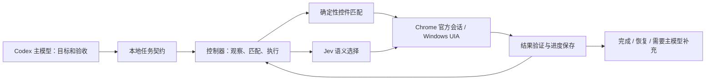

# Jev GUI Delegate

面向 Codex 的 Windows / Chrome GUI 委派原型。主模型交付任务与验收条件，本地控制器执行确定性步骤，需要语义判断时调用 TypeSafe Jev，并在每一步核对实际结果。

这是个人设计、借助 AI 实现并持续验收的工具项目。项目贡献包括任务契约、工具编排、低置信恢复、权限与状态检查、测试和反馈迭代；Jev 模型、TypeSafe SDK、Codex 和浏览器插件属于上游产品。

## 为什么做

逐步操作网页会让主模型反复读取界面、选择控件和接收工具返回。这个项目把一段可明确验收的操作交给本地控制器，减少主模型在操作循环中的参与，同时保留状态检查、异常恢复和用户接管。



## 已完成的设计

- **两条执行路径**：Chrome 复用宿主提供的官方浏览器会话；Windows 使用 UI Automation。没有复制个人浏览器配置或提取 Cookie。
- **可检查的任务契约**：目标、允许动作、范围、输入、步骤和成功条件显式定义。
- **按需使用模型**：确定性匹配由本地代码执行；语义选择调用 Jev。零模型调用按实际记录，不当作 Jev 推理成功。
- **连续执行与恢复**：保存进度，支持缺少输入的补充、局部选择修复、暂停、取消和用户接管；结果不明时不自动重放提交。
- **结果核验**：操作前核对身份和范围，操作后检查实际值或页面状态；使用量与失败原因分开记录。

## 对照测试

2026-09-23 的两轮合成任务记录，每轮都比较同样的 **4 项任务、24 个动作**。下表统计主模型 Astra 的输入和输出 token，**包含缓存输入**；Jev 的额外用量单列在[测试说明](benchmarks/README.md)。

| 指标 | 第一轮 | 第二轮 |
|---|---:|---:|
| Astra 逐步执行 token | 2,266,693 | 2,256,091 |
| 委派后 Astra token | 236,295 | 192,752 |
| Astra token 减少 | 89.6% | 91.5% |
| 两组任务完成 | 各 4/4 | 各 4/4 |
| 端到端任务速率相对基线 | 3.05 倍 | 3.53 倍 |

这是固定任务、有限样本的操作循环测试。两轮重复相同四项任务，不代表八种独立场景；结果不是账单节省比例，也不代表所有应用、任意任务或部署成本。早期三任务版本的非缓存 token 结果并未改善，详见测试说明。

## 阅读源码

| 入口 | 内容 |
|---|---|
| [gui_delegate/controller.py](gui_delegate/controller.py) | 控制器与执行循环 |
| [gui_delegate/schema.py](gui_delegate/schema.py) | 契约、状态和结果模型 |
| [gui_delegate/chrome_gateway.mjs](gui_delegate/chrome_gateway.mjs) | 官方浏览器会话入口 |
| [gui_delegate/drivers.py](gui_delegate/drivers.py) | 驱动与结构化观察 |
| [gui_delegate/security.py](gui_delegate/security.py) | 范围、授权与输入检查 |
| [gui_delegate/skill/SKILL.md](gui_delegate/skill/SKILL.md) | 可安装的个人 Codex skill |
| [jev_client.py](jev_client.py) | Jev SDK 封装、版本检查和使用量 |
| [gui_delegate/tests](gui_delegate/tests) | 控制器、恢复和边界测试 |

## 本地运行

面向 **Windows x64、Python 3.12、Node.js**。原生 GUI 需要交互式桌面；Chrome 路径还需要 Codex 宿主提供兼容的官方浏览器会话 API。本仓库不能独立创建或替代该宿主会话。

建议使用 `C:\jev\jev-bridge`，部分历史命令和 skill 示例以此为默认路径。使用其他路径时需同步调整相应示例。先安装依赖并运行离线测试：

```powershell
git clone https://github.com/YUTA-fywoo/jev-gui-delegate.git C:\jev\jev-bridge
cd C:\jev\jev-bridge
py -3.12 -m venv .venv
.\.venv\Scripts\python.exe -m pip install --require-hashes -r requirements.lock
.\.venv\Scripts\python.exe scripts/setup-runtime.py
.\.venv\Scripts\python.exe -m unittest discover -s gui_delegate/tests -p "test_*.py"
```

需要注册到 Codex 时运行 `install.cmd` 和 `gui-install.cmd`。安装器会修改用户级 MCP、skill 和路由配置，保留备份并检查冲突；已有同名目录时先检查，不覆盖本机正在使用的项目。`health.cmd` 只检查就绪状态；`verify.cmd` 等实时验证会调用 Jev 服务。

密钥由本机环境变量 `TYPESAFE_API_KEY` 或 Windows 凭据管理器提供。使用 `set-key.cmd` 的本地输入窗口设置；不要写入仓库、任务契约或聊天。`chrome-runtime.json` 由安装者本机生成并被忽略，仓库不携带原作者的环境路径。

当前 `settings.json` 固定历史测试使用的 `jev-1.13.0`。服务端版本发生变化时，应重新核验后更新，不沿用旧测试结果作为新版本质量保证。个人机器的校准证据没有上传；示例策略不作为已经完成本机校准的声明。

## 验证与限制

- 离线回归结果见[发布验证](VALIDATION.md)。这类测试使用合成数据和受控替身，不冒充现场 GUI 或实时 Jev 请求。
- 原型依赖可读取的 DOM / 辅助功能信息。Canvas、图像理解、安全桌面、部分跨框架控件和宿主未开放功能可能需要主模型补充。
- `LOCAL_INSTALL_NOTES.md`、`gui_delegate/README.md` 和 `SUPPORT.md` 保留实现背景；其中“本机已验证”指原开发环境的历史记录，不是任意安装者的验收结果。
- 运行日志、浏览器配置、密钥、个人任务材料、机器安装状态、回滚包和第三方依赖目录未公开。依赖应由安装者从原始发行渠道安装。

上游：[TypeSafe](https://docs.typesafe.ai/) · [MCP Python SDK](https://github.com/modelcontextprotocol/python-sdk) · [pywinauto](https://github.com/pywinauto/pywinauto)。

## English overview

A personal, AI-assisted Windows and Chrome GUI delegation prototype for Codex. A local controller handles deterministic interaction, calls TypeSafe Jev for semantic choices, validates outcomes, and returns compact progress or recovery information. The author designed the workflow, contracts, integration and acceptance iterations; the upstream model and SDK are not authored here.

Two repeated synthetic four-task comparisons recorded approximately 90% fewer **Astra tokens including cached input**, with Jev usage counted separately. This is a limited task-level result, not a claim of universal reliability or 90% lower total cost. See the benchmark and validation documents for scope, installation assumptions and limitations.
